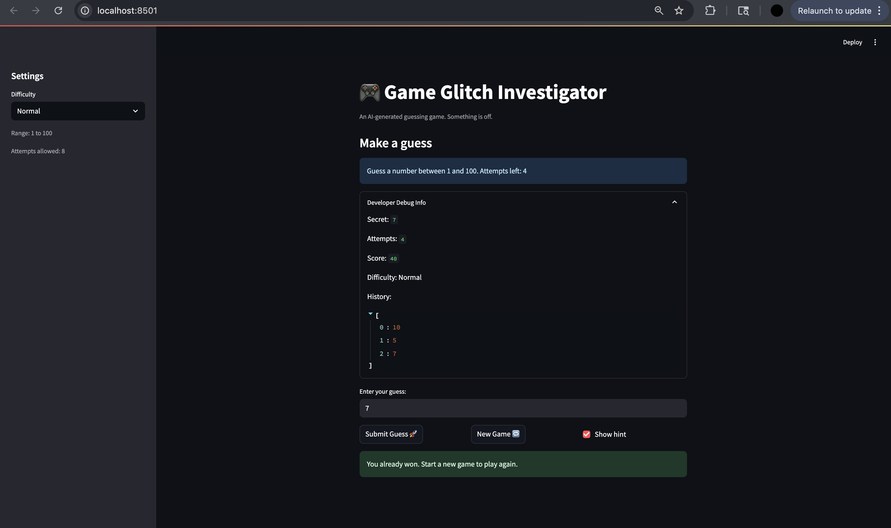

# 🎮 Game Glitch Investigator: The Impossible Guesser

## 🚨 The Situation

You asked an AI to build a simple "Number Guessing Game" using Streamlit.
It wrote the code, ran away, and now the game is unplayable. 

- You can't win.
- The hints lie to you.
- The secret number seems to have commitment issues.

## 🛠️ Setup

1. Install dependencies: `pip install -r requirements.txt`
2. Run the broken app: `python -m streamlit run app.py`

## 🕵️‍♂️ Your Mission

1. **Play the game.** Open the "Developer Debug Info" tab in the app to see the secret number. Try to win.
2. **Find the State Bug.** Why does the secret number change every time you click "Submit"? Ask ChatGPT: *"How do I keep a variable from resetting in Streamlit when I click a button?"*
3. **Fix the Logic.** The hints ("Higher/Lower") are wrong. Fix them.
4. **Refactor & Test.** - Move the logic into `logic_utils.py`.
   - Run `pytest` in your terminal.
   - Keep fixing until all tests pass!

## 📝 Document Your Experience

- [ ] Describe the game's purpose.
   - The game's purpose is to guess the lucky number within a given range. You must guess the number under a certain amount of attempts.
- [ ] Detail which bugs you found.
   1. The hint to go higher or lower seemed to be randomly innaccurate; sometimes it says higher when it should be lower, and vice versa.
   2. The new game button does not start a new game as expected. It resets the target but if a previous game was finished, it did not allow for new attempts.
   3. The levels of difficulty were wrongly assigned. Normal was numbers 1-100, but hard was 1-50, which does not make sense.
   4. Changing the level of difficulty does not actually affect anything. The ranges are still 1-100.
   5. Non-numerical numbers can be guessed after clicking submit two or more times. 
   6. The history of numbers adds every other number to the history. 

- [ ] Explain what fixes you applied.
   - I fixed I applied were fixing the higher/lower hint showing the wrong message. They were switched around.
   - I fixed the "New Game" button to work as intended, which includes resetting the history, attempts, score, and status.
   - Fixed tests that were failing.
   - Fixed the levels of difficulty to make their difficulty match the name. (Easy is actually the shortest range, Normal is a mid range, and Hard is the hardest range).

## 📸 Demo

- [ ] [Insert a screenshot of your fixed, winning game here]

## 🚀 Stretch Features

- [ ] [If you choose to complete Challenge 4, insert a screenshot of your Enhanced Game UI here]
